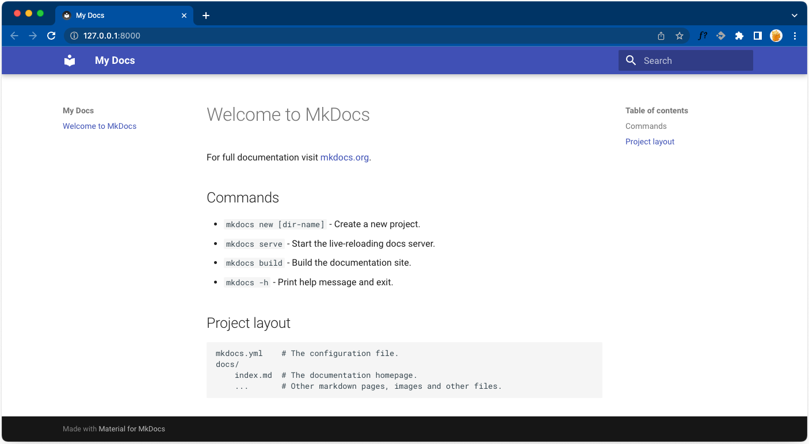

# Развертывание mkdocs

!!! info "Информация"

    В справке описано развертывание статического сайта на GitHub Pages.  
    Развертывание на Gitlab Pages возможно, но есть некоторые технические отличия.

## Подготовка окружения

Перед созданием портала на Mkdocs нужно настроить окружение на своем компьютере. Вам потребуются следующие программы:

- Git
  
- Python и PIP - для запуска Mkdocs
  
- Visual Studio Code (VSC) с плагинами и редактор markdown-файлов MarkText - для работы с репозиторием и редактирования контента.

### Установка Git

Установите [Git](https://git-scm.com/). Проверьте установленную версию в командной строке:

```
C:\> --git version
```

### Установка Visual Studio Code (VSC) с плагинами

Рекомендуется перед началом развертывания установить VSC. Он значительно упростит редактирование файлов и работу с репозиториями.
После установки VSC добавьте в него плагины для работы с Markdown:  

- [Markdown Linter](https://marketplace.visualstudio.com/items?itemName=DavidAnson.vscode-markdownlint). На лету проверяет код в маркдаун-файле и автоматически исправляет ошибки.  
- [GitHub Markdown Preview](https://marketplace.visualstudio.com/items?itemName=bierner.github-markdown-preview). Показывает, как текст в маркдауне будет отображаться после публикации на GitHub Pages.  

### Установка MarkText

Если редактирование маркдауна в VSC дается тяжело и раздражает, используйте офлайновый wysiwyg-редактор [MarkText](https://www.marktext.cc/).  
Он бесплатен и очень удобен.

## Установка и запуск Mkdocs

Чтобы установить и запустить mkdocs:

1. Запустите VS Code и откройте встроенный терминал (Ctrl+Shift+`).
2. Убедитесь, что Python и PIP установлены, выполнив следующие команды:  

    ```
    python --version  
    pip --version
    ```

    Если Python и PIP установлены, отобразятся их версии, например:  
     ``Python 3.13.2`` и ``pip 25.0.1``.  

3. Установите MkDocs с темой Material:  

    ```
    pip install mkdocs mkdocs-material
    ```  

4. Создайте папку для нашего проекта и перейдите в нее:  

    ```
    cd ~
    mkdir -p mkdocsportal
    cd mkdocsportal
    ```

5. Создайте новый проект Mkdocs:  

    ```
    mkdocs new .
    ```

    В проектной директории появятся следующие файлы и папки:  

    ```
    
    ├── docs // Папка с исходными файлами
    │   └── index.md // Главная страница
    └── mkdocs.yml // Конфигурационный файл
    ```

6. Откройте директорию проекта в VS Code (Cmd+O) и добавьте в конфигурационный файл `mkdocs.yml` следующий раздел:

    ```yml
    theme:  
      name: material  
    ```

7. Запустите MkDocs локально из терминала VS Code (Ctrl+Shift+`):
    ```
    mkdocs serve
    ```
    Начнется сборка сайта с документацией. В терминале отобразится статус выполнения. 

8. Откройте сайт в браузере: [http://127.0.0.1:8000/](http://127.0.0.1:8000/).

    
